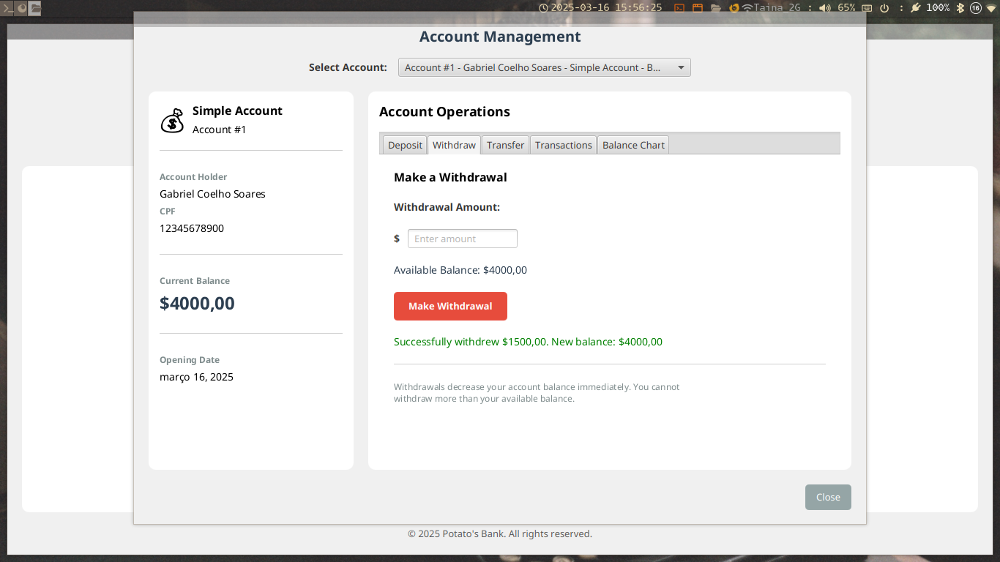

# Sistema Bancário

Um sistema bancário completo com interface gráfica construído com Java e JavaFX. Esta aplicação permite gerenciar contas bancárias, realizar transações e acompanhar investimentos.


## Executando a Aplicação

A maneira mais simples de executar a aplicação é usando o Maven:

```
mvn javafx:run --file project/pom.xml
```

Este comando irá:

1. Compilar a aplicação
2. Baixar todas as dependências necessárias
3. Iniciar a aplicação JavaFX

> **Observação**: Usuários Windows ou Mac precisam editar o `pom.xml` na linha `62`, conforme o comentário. Estará "linux" (S.O. utilizado no desenvolvimento) e deverá ser trocado conforme seu sistema operacional.

### Executando sem interface gráfica

```bash
mvn exec:java -Dexec.mainClass="br.com.devcoelho.App" --file project/pom.xml
```

## Requisitos

- Java 11 ou superior
- [Maven](https://maven.apache.org/) 3.6 ou superior
- *Sugiro a instalação pelo [SDKMAN!](https://sdkman.io/)


## Funcionalidades

### Gerenciamento de Contas

- Criar diferentes tipos de contas (Simples e Investimento)
- Gerenciar contas com depósitos, saques e transferências
- Acompanhar histórico de transações com registros detalhados
- Visualizar informações da conta e histórico de saldo com gráficos

### Recursos de Investimento

- Criar e gerenciar investimentos com taxas de juros personalizadas
- Acompanhar o crescimento do investimento ao longo do tempo
- Liquidar investimentos quando necessário
- Visualizar detalhes e desempenho dos investimentos

### Gerenciamento de Clientes

- Criar e gerenciar perfis de clientes
- Armazenar múltiplos endereços por cliente
- Validar endereços brasileiros via integração com CEP
- Acompanhar todas as contas associadas a um cliente

### Simulação de Tempo

- Simular a passagem do tempo para ver como as contas se comportam
- Aplicar taxas mensais em contas simples
- Calcular crescimento de juros em contas de investimento
- Gerar relatórios detalhados sobre alterações nas contas

### Persistência de Dados

- Todos os dados são salvos em arquivos de texto automaticamente
- Informações de contas, transações e investimentos são preservadas entre sessões

## Capturas de Tela

### Tela inicial


### Criando Conta


### Informações das contas


### Gerenciamento de Conta





### Simulação de Tempo


## Gerando um JAR

Para construir um JAR executável:

```
mvn clean package
```

Isso criará um arquivo JAR no diretório `target`. Observe que executar o JAR diretamente pode exigir configuração adicional do JavaFX. Por esse motivo, é recomendado usar `mvn javafx:run`.

## Estrutura do Projeto

- `br.com.devcoelho` - Pacote principal
  - `exceptions` - Exceções personalizadas usadas no sistema
  - `interfaces` - Definições de interfaces
  - `persistence` - Classes para carregamentsalvamento de dados
  - `ui` - Componentes de interface do usuário JavaFX

### Classes Principais

- `BankAccount` - Classe abstrata base para todas as contas
- `BankSimpleAccount` - Implementação de uma conta básica
- `BankInvestmentAccount` - Implementação de uma conta com capacidades de investimento
- `Person` - Informações e gerenciamento de clientes
- `Address` - Informações de endereço com validação de CEP brasileiro
- `Transaction` - Registros de todas as operações financeiras
- `MainApplication` - Ponto de entrada principal da aplicação JavaFX

## Banco de Dados

A aplicação utiliza arquivos de texto simples para persistência de dados:

- `clients.txt` - Informações de clientes
- `accounts.txt` - Detalhes da conta
- `investments.txt` - Informações de investimentos
- `transactions.txt` - Histórico de transações

## Melhorias Futuras

- Suporte para tipos adicionais de contas
- Capacidades aprimoradas de relatórios
- Integração com APIs bancárias externas
- Versão para aplicativo móvel

## Colaboradores

[Gabriel Coelho Soares](https://github.com/GabrielCoelho)
